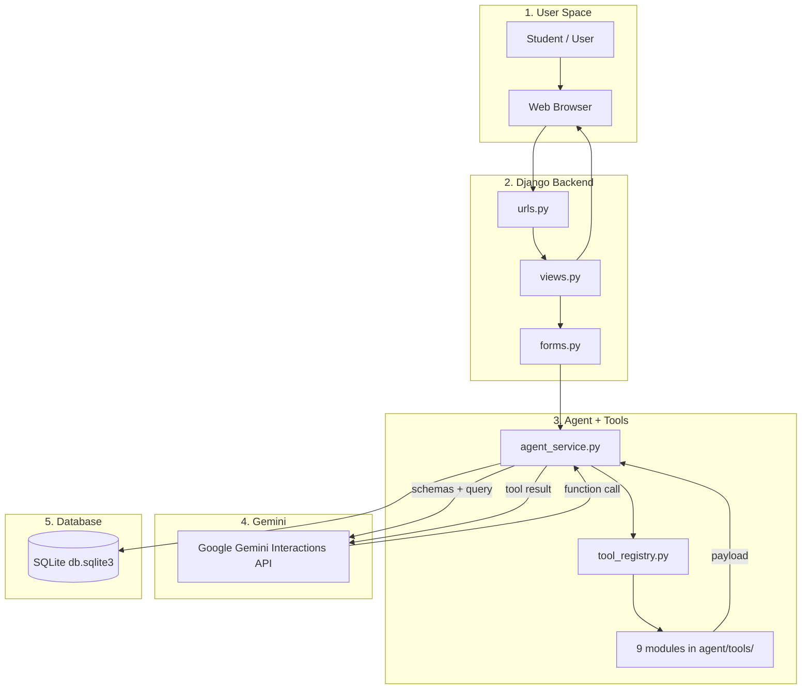

# PROJECT ARCHITECTURE FOR STUDENTS

**AgentLab - Teach AI to Choose the Right Tool**

This is the student marketing and architecture guide for **this** project: a Django-only educational AI Agent laboratory powered by **Google Gemini**.

You do **not** need prior experience with Django, APIs, or AI agents. Read this file from top to bottom. It explains what AgentLab is, why it exists, how it works, how to enroll (set it up and run it), where to put API keys, who it is for, what it does well, what it does not do, how the code is structured, and how you can develop new features yourself.

---

## Table of contents

1. [What is this project?](#1-what-is-this-project)
2. [Why is this project?](#2-why-is-this-project)
3. [How is this project?](#3-how-is-this-project)
4. [Enrollment - commands to install, seed, and run](#4-enrollment---commands-to-install-seed-and-run)
5. [How to add API keys (and where)](#5-how-to-add-api-keys-and-where)
6. [Use cases](#6-use-cases)
7. [Pros and cons](#7-pros-and-cons)
8. [Architecture in one page](#8-architecture-in-one-page)
9. [Hotel analogy](#9-hotel-analogy)
10. [System layers](#10-system-layers)
11. [Django for beginners](#11-django-for-beginners)
12. [File map](#12-file-map)
13. [Nine tools](#13-nine-tools)
14. [Agent loop](#14-agent-loop)
15. [Example request flows](#15-example-request-flows)
16. [Pages and URLs](#16-pages-and-urls)
17. [Database](#17-database)
18. [Gemini function calling](#18-gemini-function-calling)
19. [Security](#19-security)
20. [If you want to change X, go here](#20-if-you-want-to-change-x-go-here)
21. [Learning path](#21-learning-path)
22. [Glossary](#22-glossary)
23. [Feature developments - how students can extend AgentLab](#23-feature-developments---how-students-can-extend-agentlab)

---

## 1. What is this project?

**AgentLab** is an educational **multi-tool AI Agent platform**.

A student types a question in the browser, for example:

- “Calculate 25 × 64”
- “What is the weather in Hyderabad and convert it to Fahrenheit?”
- “Search for India’s population and calculate 10% of it.”

Django sends that question to **Google Gemini** together with a catalog of tools. Gemini **does not guess** live weather or do unsafe Python `eval()`. It **selects a tool**, Django **executes** that Python function, the result goes back to Gemini, and Gemini may call **another tool** (chaining) before writing a final answer.

The page then shows:

- the **final answer** (with real bold text, not leftover `**stars**`)
- **agent activity** (which tool was chosen, arguments, success/fail, timing)
- history, challenges, and API configuration status

**Tagline:** Teach AI to Choose the Right Tool.

**This is not a basic chatbot.** It is a learning lab that makes tool selection, function calling, and multi-tool chaining visible.

### What you see in the product

| Page | URL | Purpose |
|---|---|---|
| Dashboard | `/` | Ask the agent. Enter sends. Shift+Enter is a new line. |
| Tools | `/tools/` | Cards for all 9 tools and whether APIs are configured. |
| Playground | `/playground/` | Run **one tool** directly, without Gemini. |
| Agent Playground | `/playground/agent/` | Test the full agent loop. |
| Tasks | `/tasks/` | 20 scored learning challenges (beginner → advanced). |
| Activity / History | `/activity/`, `/history/` | Past runs and timelines. |
| Settings | `/settings/` | Connected / Not Configured / Demo Mode - **never shows keys**. |
| Learning Mode | `/learning/` | Visual explanation of the agent pipeline. |
| Developer | `/developer/` | Schemas, usage counts, challenge stats. |
| Add a Tool | `/add-a-tool/` | In-app guide to register a new tool. |

### Stack (this project only)

- Python 3.10+ (3.11+ recommended)
- Django + Django Templates + HTML + CSS
- Small helper script `static/js/agentlab.js` only for Enter-to-send, Shift+Enter, and the “Agent is working” overlay
- Google Gemini (`google-genai`, Interactions API, default model `gemini-3.6-flash`)
- Optional: SerpAPI, OpenWeatherMap, ExchangeRate-API
- SQLite (`db.sqlite3`)
- `python-dotenv` for `.env`

There is **no** React, Vue, Angular, Next.js, or REST frontend. The main path is still:

`HTML form → Django POST → Gemini + tools → database → template`

---

## 2. Why is this project?

Students often see ChatGPT-style answers and never see **how** an agent decides to use a calculator vs weather vs search.

AgentLab exists to teach that missing piece:

1. **Tool selection** - the model picks a named function, not a giant `if/elif` router you wrote by hand.
2. **Function calling** - arguments arrive as structured JSON (`city: Hyderabad`, `expression: 25 * 64`).
3. **Tool execution** - real Python runs on the server (safe math, APIs, converters).
4. **Tool chaining** - weather then unit converter; search then calculator.
5. **Honesty** - if Weather or Search is not configured, the app says so. It does **not** fake live data.
6. **Assessment** - 20 challenges score tool choice, arguments, execution, answer, and efficiency.

### Who it is for

- Students learning Django and backend web development
- Students learning AI agents and function calling
- Instructors who need a lab they can run locally
- Anyone who wants a visible timeline instead of a black-box chatbot

### What problem it solves

| Without AgentLab | With AgentLab |
|---|---|
| “The AI just answered.” | You see **which tool** ran and **why the numbers** appeared. |
| Math might be guessed. | Calculator uses a **safe AST evaluator** (no `eval()`). |
| Weather might be invented. | OpenWeatherMap or a clear **not configured** message. |
| Hard to practice prompting. | 20 tasks with a **100-point rubric**. |

---

## 3. How is this project?

### High-level flow

```
Student types a question
        ↓
Django view validates the form
        ↓
agent_service.run_agent(query)
        ↓
Gemini receives the question + tool schemas
        ↓
Gemini returns a function call  (name + arguments)
        ↓
Tool registry runs the matching Python module
        ↓
Result is stored as ToolExecution
        ↓
Result goes back to Gemini  (may call another tool)
        ↓
Gemini writes the final answer
        ↓
AgentExecution is saved
        ↓
Dashboard shows the answer at the top + activity timeline
```

### Keyboard and waiting (how you use it)

- **Enter** - send the prompt (Run Agent)
- **Shift+Enter** - new line in the box
- While Gemini works, an **“Agent is working”** overlay and progress bar appear so you know to wait
- When finished, the **answer is at the top** so you do not scroll past metrics first

### How Gemini is used

Gemini is the **router**, not the calculator.

- It reads tool **declarations** (name, description, parameters).
- It decides `calculator` vs `weather` vs `web_search`, etc.
- Django executes the function.
- Gemini reads the tool JSON and either chains another tool or answers in prose.
- A **maximum of 8 tool calls** stops infinite loops.

### How tools are organized

Each tool is one file under `agent/tools/`. The registry in `agent/services/tool_registry.py` lists them. Adding a tool means: write the module → register it → test it. You do **not** rewrite the agent loop.

### How data is saved

Every run creates:

- **AgentExecution** - query, final answer, status, tool count, time
- **ToolExecution** - each tool name, arguments, summary, success/fail

Challenges create **ChallengeAttempt** rows with a score out of 100.

The rest of this file (from section 8 onward) is the detailed architecture. First, enroll and run the project.

---

## 4. Enrollment - commands to install, seed, and run

Follow these steps on a new machine after unzipping the project. Use **Command Prompt** on Windows (or Terminal on macOS/Linux).

### 4.1 Prerequisites

- Python **3.10 or newer** (`python --version`)
- Internet (to install packages and later call Gemini)
- A code editor (Cursor, VS Code, etc.)

### 4.2 Go to the project folder

```cmd
cd /d C:\Users\saiha\SITS_Project
```

Use your real folder path if it is different.

### 4.3 Create and activate a virtual environment

**Windows CMD:**

```cmd
python -m venv .venv
.venv\Scripts\activate
```

**Windows PowerShell:**

```powershell
python -m venv .venv
.\.venv\Scripts\Activate.ps1
```

**macOS / Linux:**

```bash
python3 -m venv .venv
source .venv/bin/activate
```

Your prompt should show `(.venv)`.

### 4.4 Install dependencies

```cmd
python -m pip install --upgrade pip
pip install -r requirements.txt
```

This installs Django, `google-genai`, and `python-dotenv`.

### 4.5 Create the `.env` file (enrollment of secrets)

**Windows CMD:**

```cmd
copy .env.example .env
```

**macOS / Linux:**

```bash
cp .env.example .env
```

Then **edit `.env`** and paste keys (see [section 5](#5-how-to-add-api-keys-and-where)). At minimum add `GEMINI_API_KEY` to run the agent.

### 4.6 Create the database (migrate)

```cmd
python manage.py migrate
```

This creates `db.sqlite3` and all tables.

### 4.7 Enroll the 20 learning challenges (seed)

```cmd
python manage.py seed_challenges
```

You should see: `Seeded challenges (20 created, ...)` or updates if they already exist.

### 4.8 (Optional) Create an admin user

Only if you want `/admin/`:

```cmd
python manage.py createsuperuser
```

### 4.9 Run the website

```cmd
python manage.py runserver
```

Open: **http://127.0.0.1:8000/**

Stop the server with `Ctrl+C`.

### 4.10 Run tests (no real API keys required)

```cmd
python manage.py test
```

Tests mock Gemini and HTTP.

### 4.11 Django system check

```cmd
python manage.py check
```

Should report: `System check identified no issues`.

### 4.12 Full enrollment checklist

1. `python -m venv .venv` and activate it  
2. `pip install -r requirements.txt`  
3. `copy .env.example .env` and add `GEMINI_API_KEY`  
4. `python manage.py migrate`  
5. `python manage.py seed_challenges`  
6. `python manage.py runserver`  
7. Open the dashboard, type a question, press **Enter**

### 4.13 Zip reminder (sharing with classmates)

Do **not** zip `.venv`, `.env`, or `db.sqlite3`.

```cmd
cd /d C:\Users\saiha\SITS_Project
tar -a -c -f C:\Users\saiha\AgentLab.zip manage.py requirements.txt README.md .env.example .gitignore PROJECT_ARCHITECTURE_FOR_STUDENTS.md config agent templates static
```

Classmates unzip, then repeat enrollment from 4.2 and add **their own** API keys.

---

## 5. How to add API keys (and where)

### Where the keys live

| Place | What to do |
|---|---|
| **`.env`** (project root, next to `manage.py`) | Put the **real** keys here. Never commit this file. |
| **`.env.example`** | Template only - empty values. Safe to share. |
| **`config/settings.py`** | Reads keys from the environment. Do **not** paste secrets into this file. |
| **Settings page** `/settings/` | Shows Connected / Not Configured / Demo Mode only. **Never displays the key.** |

### File to edit

Open:

```text
C:\Users\saiha\SITS_Project\.env
```

### Exact variables

```env
DJANGO_SECRET_KEY=change-me-in-production
DJANGO_DEBUG=true
DJANGO_ALLOWED_HOSTS=127.0.0.1,localhost

GEMINI_API_KEY=paste-your-gemini-key-here
GEMINI_MODEL=gemini-3.6-flash

SERPAPI_API_KEY=
OPENWEATHERMAP_API_KEY=
CURRENCY_API_KEY=
```

Rules:

- **No quotes** around the key  
- **No spaces** around `=`  
- One key per line  
- After saving `.env`, **restart** `python manage.py runserver` so Django reloads the file  

### Which keys you actually need

| Variable | Required? | Get it from | If missing |
|---|---|---|---|
| `GEMINI_API_KEY` | **Yes, to run the agent** | [Google AI Studio](https://aistudio.google.com/apikey) | “Gemini is not configured.” |
| `GEMINI_MODEL` | Optional | Keep `gemini-3.6-flash` | Older names like `gemini-2.5-flash` may 404 for new keys. |
| `SERPAPI_API_KEY` | Optional | [serpapi.com](https://serpapi.com) | `web_search` says not configured. Calculator still works. |
| `OPENWEATHERMAP_API_KEY` | Optional | [openweathermap.org](https://openweathermap.org) | `weather` says not configured. |
| `CURRENCY_API_KEY` | Optional | ExchangeRate-API v6 | Currency runs in **labelled DEMO MODE** (not live rates). |

### How to add the Gemini key (step by step)

1. Open [https://aistudio.google.com/apikey](https://aistudio.google.com/apikey)  
2. Create an API key  
3. Paste it after `GEMINI_API_KEY=` in `.env`  
4. Save the file  
5. Stop the server (`Ctrl+C`) and run `python manage.py runserver` again  
6. Open `/settings/` - Google Gemini should show **Connected**  
7. On the dashboard, ask: `Calculate 25 * 64` and press Enter  

### Optional weather and search

Same pattern: create the key on the vendor site, paste into the matching line in `.env`, restart the server, check `/settings/`.

### Security for students

- Never put keys in `settings.py`, templates, GitHub, or a zip you email  
- Never screenshot `.env`  
- If a key was shared by accident, **rotate it** in Google AI Studio  

---

## 6. Use cases

| Use case | Example prompt | Tools involved |
|---|---|---|
| Classroom demo of function calling | Calculate 25% of 480 | `calculator` |
| Live facts (if SerpAPI is set) | What is the latest Python version? | `web_search` |
| Weather briefing (if OpenWeather is set) | What’s the weather in Hyderabad? | `weather` |
| Multi-tool chaining | Weather in Hyderabad in Fahrenheit | `weather` → `unit_converter` |
| Research + math | India’s population, then 10% of it | `web_search` → `calculator` |
| Time zones | What time is it in Tokyo? | `get_datetime` |
| Currency + GST (demo or live FX) | Convert 100 USD to INR and add 18% GST | `currency_converter` → `calculator` |
| Writing lab | Analyze this paragraph… | `analyze_text` |
| Data hygiene | Validate this JSON: `{...}` | `validate_json` |
| Encyclopedia lookup | What is Django? | `knowledge_search` |
| Graded lab | Any of the 20 Tasks | Agent + `challenge_evaluator` |
| Instructor inspection | Open Developer / Activity | Stored executions and schemas |

**Local-only class (no extra API keys):** calculator, unit converter, date/time, text analyzer, JSON validator, Wikipedia knowledge search, and demo currency still work. Only Gemini is required for the agent to *choose* tools.

---

## 7. Pros and cons

### Pros

- Built for **learning**, not as a hidden chatbot  
- **Gemini function calling** is the router - students see real agent design  
- **Nine tools**, including local tools that work without extra keys  
- **Multi-tool chaining** with a hard call limit  
- **20 scored challenges** (tool selection, arguments, execution, answer, efficiency)  
- **Safe calculator** (AST, no `eval()`)  
- Honest **not configured** / **demo mode** labels  
- SQLite, Django templates, easy to run in a lab  
- Activity timeline for debugging prompts  
- Tests mock Gemini so CI/class machines do not need live keys  

### Cons

- Needs a **Gemini API key** and internet for the agent itself  
- Weather and Google search need **paid/optional third-party keys**  
- Demo currency rates are **not live**  
- Gemini calls can take **several seconds**; the working overlay is required while you wait  
- Default model names change; old names can return **404**  
- Synchronous request (no Celery/WebSockets) - one browser tab waits until the agent finishes  
- SQLite is fine for class, not for a huge production load  
- Small JS helper exists for Enter/overlay; this is not a full SPA  

---

## 8. Architecture in one page

```
                    ┌───────────────────────────┐
                    │       USER / BROWSER      │
                    └─────────────┬─────────────┘
                                  │  HTTP POST (HTML Form)
                                  ▼
                    ┌───────────────────────────┐
                    │      DJANGO FRAMEWORK     │
                    │  urls.py  ➔  views.py     │
                    └─────────────┬─────────────┘
                                  │  run_agent(query)
                                  ▼
                    ┌───────────────────────────┐
                    │      AGENT ORCHESTRATOR   │
                    │  (agent_service.py loop)  │
                    └──────┬──────────────┬─────┘
                           │              │
        1. Declarations    │              │ 3. Tool Arguments
        & User Query       ▼              ▼
                   ┌──────────────┐   ┌───────────────────────────┐
                   │  GOOGLE AI   │   │       TOOL REGISTRY       │
                   │  GEMINI LLM  │   │     (tool_registry.py)    │
                   └──────┬───────┘   └─────────────┬─────────────┘
                          │                         │
        2. Function Call  │                         │ 4. Execute Function
                                         │  ┌───────────────────────────┐
                                         │  │  Calculator, Weather,     │
                                         │  │  Web Search, Convert...   │
                                         │  └───────────┬───────────────┘
                                                        │ 5. Result Payload
                                                        ▼
                    ┌───────────────────────────────────────────┐
                    │              SQLITE DATABASE              │
                    │  AgentExecution & ToolExecution           │
                    └─────────────────────┬─────────────────────┘
                                          │ 6. Render Response
                                          ▼
                    ┌───────────────────────────────────────────┐
                    │     dashboard.html  +  _execution.html    │
                    └───────────────────────────────────────────┘
```



---

## 9. Hotel analogy

Think of AgentLab as an **intelligent hotel help desk**:

| Hotel role | Project piece | File |
|---|---|---|
| Guest | You in the browser | - |
| Front desk form | HTML form | `templates/dashboard.html` |
| Receptionist | Django view | `agent/views.py` |
| Operations manager | Agent loop | `agent/services/agent_service.py` |
| Expert consultant | Google Gemini | `google-genai` |
| Department catalog | Tool registry | `agent/services/tool_registry.py` |
| Specialist departments | Tools | `agent/tools/*.py` |
| Logbook | SQLite | `agent/models.py` |

The receptionist does not personally calculate GST or check Tokyo weather. The consultant **chooses a department**; the department **does the work**; the logbook **records every step**.

---

## 10. System layers

```
1. USER & FRONTEND     templates/, static/css/, static/js/agentlab.js
2. ROUTING & VIEWS     config/urls.py, agent/urls.py, views.py, forms.py
3. AGENT ORCHESTRATION agent_service.py + Gemini function calling
4. TOOLS               agent/tools/*.py + tool_registry.py
5. DATABASE            models.py + db.sqlite3
```

| Layer | Why it exists |
|---|---|
| Frontend | Type questions, see answers, challenges, timelines |
| Views | CSRF, validation, redirects, rendering |
| Orchestration | Gemini picks tools; Django loops until a final answer |
| Tools | Real work LLMs cannot reliably do alone |
| Database | History, scores, and activity after restart |

---

## 11. Django for beginners

**Django** is a Python web framework. AgentLab uses the MTV pattern:

```
Browser → urls.py → views.py → agent_service / models → template → Browser
```

1. You submit the form on `http://127.0.0.1:8000/`  
2. `/` maps to `views.dashboard`  
3. `AgentQueryForm` validates the text  
4. `run_agent(query)` talks to Gemini and tools  
5. Rows are saved in SQLite  
6. `dashboard.html` shows the answer first, then “Ask again”

---

## 12. File map

| Priority | File | Why it matters |
|---|---|---|
| Critical | `agent/services/agent_service.py` | `run_agent()` and Gemini loop |
| Critical | `agent/services/tool_registry.py` | Register and dispatch tools |
| Critical | `agent/views.py` | Every page |
| Critical | `agent/models.py` | History and scoring tables |
| Supporting | `agent/tools/*.py` | Real tool logic |
| Supporting | `agent/services/challenge_evaluator.py` | 100-point rubric |
| Supporting | `agent/forms.py` | Input validation |
| Config | `config/settings.py` | Apps, DB, env vars |
| Config | `.env` | **Your secrets** |
| Config | `.env.example` | Names of variables only |
| UX | `templates/` | Pages |
| UX | `static/css/style.css` | Look |
| UX | `static/js/agentlab.js` | Enter / overlay |
| Teaching | `agent/management/commands/seed_challenges.py` | 20 tasks |
| Tests | `agent/tests/` | Mocks - no live keys |

---

## 13. Nine tools

| Tool | Type | File | Example |
|---|---|---|---|
| `calculator` | Local | `calculator.py` | `25 * 64` |
| `weather` | OpenWeatherMap | `weather.py` | city Hyderabad |
| `web_search` | SerpAPI | `web_search.py` | latest Python version |
| `unit_converter` | Local | `unit_converter.py` | 10 km to miles |
| `get_datetime` | Local | `datetime_tool.py` | time in Tokyo |
| `currency_converter` | Live or demo | `currency.py` | 100 USD to INR |
| `analyze_text` | Local | `text_analyzer.py` | word/sentence counts |
| `validate_json` | Local | `json_tool.py` | valid / pretty JSON |
| `knowledge_search` | Wikipedia | `knowledge_search.py` | What is Django? |

Every tool returns:

```python
{"success": True, "error": None, "summary": "...", "data": {...}}
```

---

## 14. Agent loop

Inside `run_agent()`:

1. Create `AgentExecution` (pending)  
2. Call Gemini with query + tool declarations  
3. If Gemini returns **function calls** → execute each tool → save `ToolExecution` → send results back  
4. If Gemini returns **text** → that is the final answer → break  
5. Stop at **8** tool calls and force a final answer  
6. Save success/failed and render the page  

Timeouts and friendly errors cover missing keys, 404 model names, rate limits, and network failures.

---

## 15. Example request flows

### Chain: weather then Fahrenheit

1. POST “Weather in Tokyo in Fahrenheit?”  
2. Gemini → `weather(city="Tokyo")`  
3. Gemini → `unit_converter(value=..., from_unit="C", to_unit="F")`  
4. Final sentence with **bold** temperature  
5. Timeline shows two tool cards  

### Single tool: 25% of 480

Gemini should call `calculator` with `(25/100)*480` → **120**.

### Challenge

POST on `/tasks/<id>/` → `run_agent` → `evaluate_challenge` (30+20+20+20+10) → `/tasks/results/<id>/`.

---

## 16. Pages and URLs

| Method | Path | View |
|---|---|---|
| GET/POST | `/` | `dashboard` |
| GET | `/tools/` | `tools_page` |
| GET/POST | `/playground/` | `playground` |
| GET/POST | `/playground/agent/` | `agent_playground` |
| GET | `/tasks/` | `tasks` |
| GET/POST | `/tasks/<id>/` | `challenge_detail` |
| GET | `/tasks/results/<id>/` | `challenge_result` |
| GET | `/activity/` | `activity` |
| GET | `/activity/<id>/` | `activity_detail` |
| GET | `/history/` | `history` |
| GET | `/settings/` | `settings_page` |
| GET | `/learning/` | `learning` |
| GET | `/developer/` | `developer` |
| GET | `/add-a-tool/` | `add_tool_guide` |

---

## 17. Database

```
AgentExecution 1 ──< ToolExecution
AgentExecution 1 ──< ChallengeAttempt
Challenge      1 ──< ChallengeAttempt
```

- **AgentExecution** - one student question  
- **ToolExecution** - one tool call inside that question  
- **Challenge** - a lab task with `expected_tools`  
- **ChallengeAttempt** - score, feedback, breakdown JSON  

---

## 18. Gemini function calling

Tool schema example sent to Gemini:

```json
{
  "type": "function",
  "name": "calculator",
  "description": "Evaluate a mathematical expression safely.",
  "parameters": {
    "type": "object",
    "properties": {
      "expression": { "type": "string" }
    },
    "required": ["expression"]
  }
}
```

The app uses `client.interactions.create(...)` and `previous_interaction_id` so Gemini remembers earlier tool results in the same question.

`GEMINI_API_KEY` is loaded in `config/settings.py` from `.env`. It is never written into templates.

---

## 19. Security

- `` on every POST form  
- Django form validation + tool argument validation  
- Calculator uses `ast` only - no `eval()`, no shell  
- API keys only in `.env`  
- HTML is escaped before markdown-like **bold** is applied  
- `AGENT_MAX_TOOL_CALLS` caps the loop  
- HTTP timeouts on external APIs  

This project does **not** use Celery, Redis, or WebSockets. One POST waits until the agent finishes (the working overlay covers that wait).

---

## 20. If you want to change X, go here

| I want to… | File |
|---|---|
| Add a tool | `agent/tools/my_tool.py` + `_TOOL_MODULES` in `tool_registry.py` |
| Change Gemini’s personality | `SYSTEM_PROMPT` in `agent_service.py` |
| Change model | `GEMINI_MODEL` in `.env` |
| Add a page | `agent/urls.py` + `views.py` + `templates/` |
| Change dashboard | `templates/dashboard.html` |
| Change look | `static/css/style.css` |
| Change Enter / overlay | `static/js/agentlab.js` |
| Add a challenge | `seed_challenges.py` then `python manage.py seed_challenges` |
| Change max tool calls | `AGENT_MAX_TOOL_CALLS` in `.env` / settings |

---

## 21. Learning path

1. Run the server and try Dashboard prompts (Enter to send).  
2. Open `/learning/` and `/tools/`.  
3. Run a **local** tool in Playground (`25 * 64`).  
4. Read `templates/dashboard.html` and `_execution.html`.  
5. Trace `urls.py` → `views.py`.  
6. Read `models.py`.  
7. Read `calculator.py`, then `tool_registry.py`.  
8. Read `run_agent()` in `agent_service.py`.  
9. Complete Tasks from beginner to advanced.  
10. Add your own tool using section 23.

---

## 22. Glossary

- **Agent** - an LLM that can call tools and loop until it answers  
- **Function calling** - the model outputs a tool name + JSON arguments  
- **Tool registry** - catalog of name, schema, and Python function  
- **Chaining** - more than one tool for one question  
- **CSRF** - token so forms only submit from this site  
- **ORM** - Django talking to SQLite with Python  
- **AST** - safe tree used instead of `eval()` for math  

You do **not** need to memorize every file. Understand: **form → view → Gemini → tool → database → page**.

---

## 23. Feature developments - how students can extend AgentLab

This section is for **your own development** after the base lab works. Use it as a mini product backlog.

### 23.1 How development works in this codebase

Keep the same pattern every time:

1. **Decide the feature** (new tool, new page, better scoring, new API).  
2. **Keep routing in Gemini** - do not add a giant `if query.contains("weather")`.  
3. **Tools stay modular** - one file, one `execute()`, one schema.  
4. **Views stay thin** - validate form, call a service, render template.  
5. **Never fake live APIs** - if the key is missing, return a clear error.  
6. **Write a test** in `agent/tests/` (mock HTTP / Gemini).  
7. **Restart the server** after `.env` or Python changes if Django does not reload.

### 23.2 Feature idea: add a new tool (the most important skill)

Example ideas: **QR code info**, **password strength**, **BMI calculator**, **news headlines**, **translation**, **file word-count upload**.

**Steps:**

1. Create `agent/tools/bmi.py` (or your name).  
2. Export `NAME`, `DESCRIPTION`, `CATEGORY`, `SCHEMA`, `EXAMPLES`, `execute()`.  
3. `execute()` must return `success`, `summary`, `error`, `data`.  
4. Append the module to `_TOOL_MODULES` in `agent/services/tool_registry.py`.  
5. Open `/playground/?tool=your_tool_name` and run it **without** Gemini.  
6. Add a unit test (no live network).  
7. Add a challenge in `seed_challenges.py` and run:

```cmd
python manage.py seed_challenges
```

8. Ask the **agent** a natural-language question and confirm Gemini selected your tool.  
9. Check `/developer/` for the new schema.

In-app copy of this path: **http://127.0.0.1:8000/add-a-tool/**

### 23.3 Feature idea: new learning challenges

- Open `agent/management/commands/seed_challenges.py`  
- Add a dict with `order`, `title`, `description`, `difficulty`, `expected_tools`, `points`, `sample_query`  
- Re-run `python manage.py seed_challenges`  
- Optionally tighten `challenge_evaluator.py` if you need stricter argument checks  

### 23.4 Feature idea: better evaluation

Today scoring is:

- Tool selection 30  
- Arguments 20  
- Execution 20  
- Final answer 20  
- Efficiency 10  

You could add: expected numeric answer, required city name, penalty if `web_search` is used for a pure math question.

### 23.5 Feature idea: more APIs

| Feature | Where to plug in |
|---|---|
| Live news | New tool + key in `.env` + Settings card in `views._api_status` |
| Translation API | New tool module + schema |
| Maps / distance | New tool; never fake coordinates |
| Email the answer | New view + Django email settings - not a Gemini tool unless you intend it |

Always: add the variable to `.env.example`, `config/settings.py`, and the Settings page **status only**.

### 23.6 Feature idea: UI / UX

| Idea | Files |
|---|---|
| New color theme | `static/css/style.css` (`:root` variables) |
| Extra sample prompts | `SAMPLE_PROMPTS` in `agent/views.py` |
| Printable challenge certificate | New template + view |
| Dark/light toggle | CSS + a form POST (keep it simple) |

### 23.7 Feature idea: accounts (harder)

Right now anyone on the local server shares one history. A student project could add `django.contrib.auth`, a `user` ForeignKey on `AgentExecution`, and login templates. Do this only after you understand views and models.

### 23.8 Feature idea: production hardening (advanced)

- Change `DJANGO_DEBUG=false` and set a real `DJANGO_SECRET_KEY`  
- Host on a VPS with `gunicorn` + nginx  
- Use PostgreSQL instead of SQLite  
- Rate-limit dashboard POSTs  
- Still **never** commit `.env`  

### 23.9 Suggested mini-projects (pick one)

1. **Tool:** BMI or tip calculator (local, easy).  
2. **Tool:** World clock for 5 cities in one query (datetime chaining).  
3. **Challenge pack:** 5 new advanced tasks that need 3 tools.  
4. **Settings:** show last successful Gemini call time (no keys).  
5. **Playground:** extra examples per tool on the tools page.  
6. **Docs:** a one-page lab worksheet for your class using this file.

### 23.10 Definition of done for a student feature

- [ ] Works without JavaScript except the existing Enter/overlay helper (or you document any new JS)  
- [ ] CSRF on new POST forms  
- [ ] Friendly errors, no stack traces in the UI  
- [ ] Tests added or updated  
- [ ] `.env.example` updated if you added a key name  
- [ ] A Task or Playground path so a classmate can try it  

---

*AgentLab student guide - understand it, run it, then extend it.*
